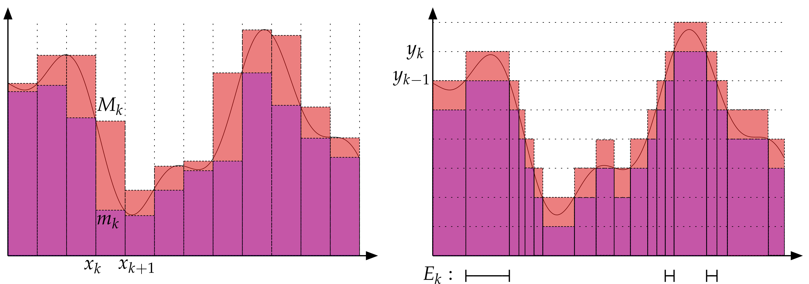
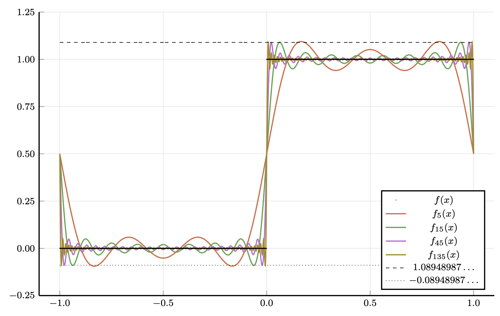

## Doel van dit hoofdstuk

::: {.hidden}
$$
% Math operators
\DeclareMathOperator{\Aut}{Aut}
\DeclareMathOperator{\End}{End}
\DeclareMathOperator{\Hom}{Hom}
\DeclareMathOperator{\GL}{GL}
\DeclareMathOperator{\SL}{SL}
\DeclareMathOperator{\Unitary}{U}
\DeclareMathOperator{\Orthogonal}{O}
\DeclareMathOperator{\SU}{SU}
\DeclareMathOperator{\SO}{SO}
\DeclareMathOperator{\Aff}{Aff}
\DeclareMathOperator{\dom}{dom}
\DeclareMathOperator{\cod}{codom}
\DeclareMathOperator{\D}{\mathcal{D}}
\DeclareMathOperator{\E}{\mathcal{E}}
\DeclareMathOperator{\R}{\mathcal{R}}
\DeclareMathOperator{\Schw}{\mathcal{S}}
\DeclareMathOperator{\im}{im}
%\DeclareMathOperator{\ker}{ker}
%\DeclareMathOperator{\dim}{dim}
\DeclareMathOperator{\codim}{codim}
\DeclareMathOperator{\convhull}{co}

\newcommand{\opgreek}[1]{\begingroup\mathgroup-1 #1\endgroup}
\DeclareMathOperator{\rank}{rank}
\DeclareMathOperator{\nullity}{nullity}

\DeclareMathOperator{\Pv}{Pv}

\DeclareMathOperator{\tr}{tr}
\DeclareMathOperator{\sgn}{sgn}
\DeclareMathOperator{\id}{id}
\DeclareMathOperator{\adj}{adj}

\DeclareMathOperator*{\varmin}{min}
\DeclareMathOperator*{\varmax}{max}
\DeclareMathOperator*{\argmin}{arg\ min}
\DeclareMathOperator*{\argmax}{arg\ max}
\DeclareMathOperator{\order}{\mathscr{O}}
\DeclareMathOperator{\sign}{sgn}
\DeclareMathOperator{\spanop}{span}
\DeclareMathOperator{\arctanh}{arctanh}
\DeclareMathOperator{\arccosh}{arccosh}
\DeclareMathOperator{\arcsinh}{arcsinh}
\DeclareMathOperator{\arccot}{arccot}
\DeclareMathOperator{\sinc}{sinc}

\newcommand{\commutator}[2]{{\left[#1,#2\right]}}
\newcommand{\anticommutator}[2]{{\left\{#1,#2\right\}}}

\DeclareMathOperator{\real}{Re}
\DeclareMathOperator{\imag}{Im}
\newcommand{\conj}[1]{{\overline{#1}}}
\newcommand{\abs}[1]{{\left\lvert#1\right\rvert}}
\newcommand{\norm}[1]{{\left\lVert#1\right\rVert}}
\newcommand{\inner}[2]{{\left\langle#1,#2\right\rangle}}

\newcommand{\drm}{{\mathrm{d}}}
\newcommand{\erm}{{\mathrm{e}}}
\newcommand{\irm}{{\mathrm{i}}}

% VECTORS
\newcommand{\vect}[1]{{#1}}
\renewcommand{\vec}[1]{\boldsymbol{#1}} % specifically for vectors in F^n
\newcommand{\zerovec}{{o}}
\renewcommand{\vu}{\vect{u}}
\newcommand{\vv}{\vect{v}}
\newcommand{\vw}{\vect{w}}
\newcommand{\ve}{\vect{e}}
\newcommand{\vf}{\vect{f}}
\newcommand{\vx}{\vect{x}}
\newcommand{\vy}{\vect{y}}

% MATRICES
\newcommand{\mat}[1]{{\mathsf{#1}}}
\newcommand{\zeromat}{\mat{O}}
\newcommand{\idmat}{\mat{I}}

% SCALARS
\newcommand{\scalara}{{a}}
\newcommand{\scalarb}{{b}}
\newcommand{\scalarc}{{c}}

% LINEAR MAPS
\DeclareMathAlphabet{\mymathbb}{U}{BOONDOX-ds}{m}{n}
\newcommand{\map}[1]{{\hat{#1}}}
\newcommand{\idmap}{\map{1}}
\newcommand{\zeromap}{\map{0}}

\newcommand{\transpose}{{\mathsf{T}}}
\newcommand{\hermitian}{{\mathsf{H}}}

\renewcommand{\d}{{\mathrm{d}}}

% FIELDS
\newcommand{\bbF}{{\mathbb{F}}}
\newcommand{\bbN}{{\mathbb{N}}}
\newcommand{\bbZ}{{\mathbb{Z}}}
\newcommand{\bbQ}{{\mathbb{Q}}}
\newcommand{\bbR}{{\mathbb{R}}}
\newcommand{\bbC}{{\mathbb{C}}}
\newcommand{\bbH}{{\mathbb{H}}}
\newcommand{\bbT}{{\mathbb{T}}}

% RELATIONS
\newcommand{\subspace}{{\preccurlyeq}}
\newcommand{\supspace}{{\succcurlyeq}}

\newcommand{\eps}{{\varepsilon}}
\newcommand{\levicivita}{{\epsilon}}

\newcommand{\sx}{{\sigma^x}}
\newcommand{\sy}{{\sigma^y}}
\newcommand{\sz}{{\sigma^z}}
\renewcommand{\sp}{{\sigma^+}}
\newcommand{\sm}{{\sigma^-}}

\DeclareMathOperator*{\sumint}{
\mathchoice
  {\ooalign{$\displaystyle\sum$\cr\hidewidth$\displaystyle\int$\hidewidth\cr}}
  {\ooalign{\raisebox{.14\height}{\scalebox{.7}{$\textstyle\sum$}}\cr\hidewidth$\textstyle\int$\hidewidth\cr}}
  {\ooalign{\raisebox{.2\height}{\scalebox{.6}{$\scriptstyle\sum$}}\cr$\scriptstyle\int$\cr}}
  {\ooalign{\raisebox{.2\height}{\scalebox{.6}{$\scriptstyle\sum$}}\cr$\scriptstyle\int$\cr}}
}
$$
:::

* Inzicht krijgen in de complicaties van het werken met functieruimten
* Orthonormale basissen voor functieruimten:
  * orthogonale veeltermen:
    * belangrijkste eigenschappen
    * voornaamste families die relevant zijn in de fysica
  * Fourierreeks:
    * eigenschappen
    * convergentiesnelheid
    * verband met discrete Fouriertransformatie

## Doel van dit hoofdstuk

* Belangrijkste operatoren op functieruimten:

  integraaloperatoren, multiplicatie-operatoren, differentiaaloperatoren
* Eigenschappen van onbegrensde operatoren
  * Toegevoegde van onbegrensde operator
  * Verschil tussen symmetrisch en zelftoegevoegd
  * Belang hiervan in de context van differentiaaloperatoren en randvoorwaarden

* Intuïtie krijgen voor de spectraaltheorie van begrensde en onbegrensde operatoren op oneindig-dimensionale Hilbertruimten aan de hand van relevante voorbeelden

# Functieruimten en normen

(geen stellingen of bewijzen)

## Functieruimten

Gegeven een vectorruimte $Y$ over $\bbF$ en een willekeurige verzameling $X$:

verzameling $Y^X$ van functies $f:X \to Y$ vormt een vectorruimte over $\bbF$, waarbij de lineaire structuur gewoon puntsgewijs wordt gedefinieerd m.b.v. deze van $Y$:

$$(a f + b g)(x) = a f(x) + b g(x), \forall x \in X$$

Voorbeelden:

* $Y = \bbF$, $X = \{1,\ldots,n\}$: $Y^X \cong \bbF^n$
* $Y = \bbF$, $X = \bbN_0$: vectorruimte van oneindig lange rijen
  
$\rightarrow$ functieruimte wordt typisch gebruikt in de context waar $X$ onaftelbaar is:

  * $X = [a,b]$, $X = \bbR$, $X = \Omega \subseteq \bbR^d$

$\rightarrow$ bijkomende eigenschappen: continuïteit, kwadratische integreerbaarheid, … 

  * belangrijk dat deze compatibel zijn met (behouden blijven onder) lineaire combinaties

## Lebesgue-ruimten

We willen ook graag minstens een norm (vanaf sectie 7.2: inwendig product):

$$f:X \to Y \quad \rightarrow \quad\norm{f}_p = \left(\int_{X} \norm{f(x)}_Y^p \,\drm x\right)^{1/p} \quad ?$$

* $Y$ moet zelf reeds een norm hebben:

  vanaf nu $Y = \bbF$: $\norm{f(x)}_Y = \abs{f(x)}$ (voor de eenvoud, veralgemening triviaal)

* We hebben een concept van integreren over $X$ nodig $\Rightarrow$ bijkomende complicaties
  * $X$ voldoende regulier: vanaf nu $X = [a,b]\subseteq \bbR$ of $X = \bbR$ (voor de eenvoud)
  * de functie $f$ moet "integreerbaar" zijn binnen het gebruikte integraalconcept
  * de integraal mag niet divergeren
  * de integraal moet voldoen aan driehoeksongelijkheid
  * de integraal kan nul worden voor functies die niet de nul-functie zijn

$\rightarrow$ beperken tot deelverzameling van functies: moet deelruimte zijn!

## Lebesgue-ruimten

$\mathcal{L}^p(I,\bbF)$ is de verzameling van functies $f:I\to \bbF$ (met dus $I=[a,b]$ of $I = \bbR$) die integreerbaar zijn en waarvoor $\int_I \abs{f(x)}^p \,\drm x$ eindig is

* preciese definitie hangt af van integraalconcept (zie verder)
* als $f$ integreerbaar is, is $\abs{f}^p$ integreerbaar
* het geval $p=\infty$ laten we voorlopig buiten beschouwing
* $\mathcal{L}^p(I,\bbF)$ vormt een vectorruimte (lineaire combinaties van twee integreerbare functies is integreerbaar, integraal van $\abs{a f(x) + b g(x)}^p$ can begrensd worden met behulp van convexiteit van $\abs{\cdot}^p$
* resulterende definitie $\norm{f}_p = \left(\int_I \abs{f(x)}^p \,\drm x\right)^{1/p}$ voldoet aan driehoeksongelijkheid (Minkowski)
* $\norm{f}_p$ is niet positief definiet, er zijn niet-triviale functies waarvoor $\norm{f}_p = 0$ 

  $\Rightarrow$ seminorm

## Van seminorm naar norm

Observatie 1:voor $f,g \in \mathcal{L}^p(I,\bbF)$

* $\norm{f}_p = 0$ en $\norm{g}_p = 0$ $\Rightarrow \norm{a f + b g}_p = 0$ 
  
  (wegens driehoeksongelijkheid en absolute homogeniteit)
  
  $\Rightarrow$ verzameling $U = \{f | \norm{f}_p = 0\}$ vormt deelruimte van $\mathcal{L}^p(I,\bbF)$

* functies waarvoor $\norm{f - g}_{p} = 0 \Leftrightarrow f-g \in U$ noemen we "bijna overal" gelijk; dit is een equivalentierelatie

$\rightarrow$ $L^p(I,\bbF) = \mathcal{L}^p(I,\bbF)/U$: de vectorruimte van equivalentieklassen van functies die bijna overal gelijk zijn

* (in de praktijk werken we nog steeds gewoon met functies, die dan representatief zijn voor alle andere functies binnen die equivalentieklasse)

## Van seminorm naar norm

Observatie 2: voor $f,g \in \mathcal{L}^p(I,\bbF)$

* $\norm{f - g}_{p} = 0$ $\Rightarrow \norm{f}_p = \norm{g}_p$

  (wegens $\abs{\norm{f}-\norm{g}} \leq \norm{f - g}$, eveneens uit driehoeksongelijkheid)

* $\norm{f}_p$ neemt voor alle functies binnen een equivalentieklasse dezelfde waarde aan

* met elk element uit $L^p(I,\bbF)$ kan een eenduidige waarde $\norm{f}_p$ worden geassocieerd (onafhankelijk van de keuze $f$ binnen de klasse)

* Op $L^p(I,\bbF)$ is $\norm{\cdot}_p$ een norm

* Is $L^p(I,\bbF)$ metrisch compleet (Banachruimte) ?

  * deze vraag ereist dat we integralen en limieten kunnen omdraaien, e.g.:

    $$\lim_{n\to \infty} \int_I \abs{f_n(x)}^p\,\drm x = \int_I \abs{\lim_{n\to\infty} f_n(x)}^p\,\drm x = \int_I \lim_{n\to\infty} \abs{f_n(x)}^p\,\drm x \quad ?$$

  * tegenvoorbeeld: $f_n(x) = 2n^2 \exp(-n^2 x^2)$

    $\Rightarrow$: $f_n \to 0$ terwijl $\int_0^1 f_n(x)\,\drm x = 1 - \exp(-n^2) \to 1$

## Lebesgue-integraal

* Riemann-integraal $\int_a^b f(x)\,\drm x$:
  * partitie $P$ van $[a,b]$: $\Delta_k = [x_{k-1},x_k]$ met $a = x_0 < x_1 < \ldots < x_{n_1} < x_n=b$
  * $m_k = \inf_{x \in \Delta_k} f(x)$ en $M_k = \sup_{x \in \Delta_k} f(x)$:
  
    $s_{f,P} = \sum_{k=1}^{n} m_k (x_k - x_{k-1})$ en $S_{f,P} = \sum_{k=1}^{n} M_k (x_k - x_{k-1})$
  * integraal bestaat als $s_f = \sup_{P} s_{f,P} =  \inf_{P} S_{f,P} = S_f$
    
    (functies met "niet te veel" discontinuïteiten)

  werkt niet voor bvb $\chi_\bbQ(x) = \begin{cases} 1,& x \in \bbQ\\ 0,& x \in \bbR\setminus \bbQ \end{cases}$ (Dirichlet functie)

  * Voorwaarden voor het omdraaien van limieten en integralen met Riemann-integraal zijn heel streng
  * Er zijn rijen van integraarbare functies waarvoor de limiet bestaat maar niet (Riemann)-integreerbaar is

## Lebesgue-integraal

* Lebesgue-integraal $\int_a^b f(x)\,\drm x$: eerst voor $0 \leq f(x) \leq M$
  * partitie van $[0,M]$: $0 = y_0 < y_1 < \ldots < y_{n-1} < y_n = M$
  * invers beeld (pre-image) $E_k = f^{-1}([y_{k-1},y_k))$
  * $l_{f,P} = \sum_{k=1}^{n} y_{k-1} \mu(E_k)$ en $L_{f,P} = \sum_{k=1}^{n} y_k \mu(E_k)$
  
    met $\mu(E_k)$ de "grootte" (maat) van $E_k$

  

## Lebesgue-integraal

* Probleem zit verdoken in de maat $\mu(E_k)$:

  $E_k$ is niet noodzakelijk een interval; meer algemene deelverzameling van $\bbR$

  We willen graag:
  * $\mu([a,b]) = \mu([a,b)) = \mu((a,b]) = \mu((a,b)) = b - a$ ($\forall a < b \in \bbR$)
  * $\mu\left(\bigcup\{A_i, i= 1,2,\ldots\}\right) = \sum_{i} \mu(A_i)$ voor disjuncte verzamelingen $A_i$ (countable additivity)

  $\Rightarrow$ een $\mu$ met deze eigenschappen kan niet worden gedefinieerd voor de collectie $\mathcal{P}(\bbR)$ van alle mogelijke deelverzamelingen van $\bbR$ (of van een interval binnen $\bbR$)

  $\Rightarrow$ de definitie van $\mu$ wordt beperkt tot een subcollectie van toegelaten deelverzamelingen van $\bbR$

  $\Rightarrow$ een functie is Lebesgue-integreerbaar als alle inverse beelden $E_k = f^{-1}([y_{k-1},y_k))$ van dit toegelaten type zijn

  $\Rightarrow$ een functie die Riemann-integreerbaar is, is Lebesgue-integreerbaar en de integralen hebben dezelfde waarde

  "Lebesgue integralen verhouden zich tot Riemann integralen zoals $\bbR$ tot $\bbQ$"

## "Bijna overal" en "maat nul" (nulverzamelingen)

* Een positieve functie $f$ heeft $\int_I f(x)\,\drm x = 0$ enkel als de verzameling $N=\{x | f(x)>0\}$ maat nul heeft: $\mu(N) = 0$

* Nulverzamelingen: verzamelingen $N$ met $\mu(N)=0$
  * Individueel punt
  * Aftelbaar eindig aantal punten
  * Ook onaftelbare verzamelingen kunnen maat nul hebben

* Andere "bijna overal" definities:

  * functies $f$ en $g$ zijn bijna overal gelijk, als er een verzameling $N$ bestaat met $\mu(N)=0$ zodat $f(x)=g(x)$ voor alle $x \in I \setminus N$

  * $\lim_{n \to \infty} f_n$ convergeert "bijna overal" puntsgewijs naar $f$, als er een verzameling $N$ bestaat met $\mu(N)=0$ zodat $\lim_{n \to \infty} f_n(x) = f(x)$ voor alle $x \in I \setminus N$

## Compleetheid van $L^p(I;\bbF)$

* Er kan worden aangetoond dat $L^p(I,\bbF)$ een Banachruimte is (stelling van Riesz-Fischer)

  (zonder bewijs)

* uitbreidingen:

  * voor $p=\infty$: $L^\infty(I,\bbF)$ gedefinieerd via
    $\norm{f}_\infty = \mathrm{ess}\ \sup_{x\in I} \abs{f} = \inf\big\{M \geq 0 |\ \mu\left(\{x \in I | \abs{f(x)}> M\right\}) = 0\big\}$

  * $L^p_w(I,\bbF)$ met norm $\norm{f}_{p,w} = \left(\int_{I} w(x) \abs{f(x)}^p \,\drm x\right)^{1/p}$
    voor integreerbare functie $w$ met $w(x)>0$ voor alle $x \in I$
  
## Bijkomende opmeringen

* $I = [a,b]$ (compact): $L^p(I,\bbF) \subspace L^q(I,\bbF)$ als $p > q$

  $I = \bbR$: $L^p(I,\bbF)$ en $L^q(I,\bbF)$ hebben elk elementen die de andere niet bevat

* Interessante dichte deelruimtes als $I$ compact:

  * polynomen
  * continue functies $C^0(I,\bbF)$, gladde functies $C^\infty(I,\bbF)$, elke $C^k(I,\bbF)$ voor $k \in \bbN$

  $\Rightarrow \overline{C^k(I,\bbF)} = L^p(I,\bbF)$: sluiting hangt af van definitie limiet en dus van $\norm{\cdot}_p$

* Interessante dichte deelruimtes als $I = \bbR$:

  * $C_c^k(I,\bbF)$: continu (afleidbare) functies met compacte "drager" (support)

    $\rightarrow$ $\mathrm{supp}(f) = \overline{\{ x \in I |\ f(x) \neq 0\}} \subseteq I$

* $L^p(I,\bbF)$ is "separabel": laat aftelbare fundamentele verzameling $S$ toe
  
  (verzameling waarvoor geldt dat $\overline{\bbF S} = L^p(I,\bbF)$, niet noodzakelijk een basis) 
  
  * $I$ compact: $S=\{x^k,k\in\bbN\}$, $S=\{\exp(\irm \frac{2\pi}{L} k x), k \in\bbZ\}$, \dots
  * $I = \bbR$: $S=\{x^n \chi_{[-N,N]}, n \in \bbN, N \in \bbN\}$

# Hilbertruimten en inwendig product

## Hilbertruimten en inwendig product

* $L^2(I,\bbF)$ is een Hilbertruimte: $\norm{\cdot}_2$ voldoet aan parallellogramregel en is afkomstig van het inwendig product

  $$\inner{f}{g} = \int_I \overline{f(x)}g(x)\,\drm x$$

* $L_w^2(I,\bbF)$ is een Hilbertruimte: $\norm{\cdot}_{2,w}$ voldoet aan parallellogramregel en is afkomstig van het inwendig product

  $$\inner{f}{g}_w = \int_I w(x) \overline{f(x)}g(x)\,\drm x$$

  met dus $w(x) > 0$ voor $x \in I$ (op nulverzameling na)

* nog algemener: $\inner{f}{g} = \iint_I w(x,y) \overline{f(x)}g(y)\,\drm x\drm y$ ?

  $\rightarrow$ weinig gebruikt, precieze voorwaarden op $w(x,y)$ niet duidelijk

# Orthogonale veeltermen

## Orthogonale veeltermen

* $\{x^n, n\in\bbN_0\}$ is een fundamentele verzameling voor:

  * $L^2([a,b], \bbF)$
  * $L^2_w(I, \bbF)$ voor $I = \bbR$ of $I = \bbR_{\geq 0}$ in combinatie met goed gekozen $w$

* $\{x^n, n\in\bbN_0\}$ kan omgevormd worden tot een basis door de equivalente orthogonale/orthonormale rij te vormen via het Gram-Schmidt algoritme (en dan het expansietheoriem toe te passen)

* Verschillende families van orthogonale polynomen
  (door keuzes van $I$ en $w$)

## Orthogonale veeltermen

Gram-Schmidt algoritme toegepast op $\{x^n, n\in\bbN_0\}$ $\Rightarrow$ $\{p_n(x), n \in \bbN_0\}$ met

* $p_n(x)$ is een polynoom van graad $n$ met reële coëfficiënten
  * volgt uit structuur Gram-Schmidt
  * $p_n(x)$ is orthogonaal op alle met polynomen van graad $<n$
  * niet steeds genormaliseerd: $\inner{p_n}{p_m}_w \sim C_n \delta_{n,m}$
  * voor symmetrisch interval en $w(x)=w(-x)$:
  
    $p_n$ bevat enkel even (oneven) machten van $x$ voor $n$ even (oneven)

* $x p_n(x) = a_{n} p_{n+1}(x) + b_n p_{n}(x) + c_{n} p_{n-1}(x)$

  met $c_0 = 0$ en $c_{n} \inner{p_{n-1}}{p_{n-1}}_w = a_{n-1} \inner{p_n}{p_n}_w$ $\Rightarrow c_n = a_{n-1}$
  
  * vermenigvuldigen met $x$ heeft tridiagonale "matrixrepresentatie" t.o.v. basis $p_n$

  * als normalisatie van basis $n$-onafhankelijk:
  
    $c_n = a_{n-1} \Leftrightarrow$ symmetrische matrixrepresentatie

## Orthogonale veeltermen

* Orthogonale projector op deelruimte van polynomen van graad $n$:

  $$(\map{P}_n f)(x) = \int_I w(y) K_n(x,y) f(y)\,\drm y = \int_I w(y) \left[\sum_{k=0}^{n} \frac{p_k(x) p_k(y)}{\inner{p_k}{p_k}_w} \right] f(y)\,\drm y$$

  met hierin (Christoffel-Darboux formule):
  $$\sum_{k=0}^{n} \frac{p_k(x) p_k(y)}{\inner{p_k}{p_k}_w} = \begin{cases} \frac{a_n}{\inner{p_n}{p_n}_w} \frac{ p_{n+1}(x) p_n(y) - p_{n}(x) p_{n+1}(y)}{x-y},& x \neq y\\
 	\frac{a_n}{\inner{p_n}{p_n}_w} ( p_{n+1}'(x) p_n(y) - p_{n}'(x) p_{n+1}(y)),& x = y
 \end{cases}$$

* $p_n$ heeft $n$ verschillende nulpunten in $I$;

  de nulpunten van $p_n$ liggen tussen deze van $p_{n+1}$ in (alternerend)

## Orthogonale veeltermen: Legendre

* $I = [-1,+1]$, $w(x)=1$:

  \begin{align*}
  \begin{split}
    &P_0(x) = 1,\quad P_1(x) = x,\quad P_2(x) = \frac{1}{2}(3 x^2 - 1),\\
    &P_3(x) = \frac{1}{2}(5x^3-3x),\quad P_4(x) = \frac{1}{8}(35 x^4 - 30x^2 + 3), \quad \ldots
  \end{split}
  \end{align*}

* Genererende functie (Legendre 1782): $\frac{1}{\sqrt{1 - 2x t + t^2}} = \sum_{n=0}^{+\infty} P_n(x) t^n$

  $\rightarrow$ nuttig om eigenschappen aan te tonen:
  * uit $\int_{-1}^{+1} \frac{1}{\sqrt{1 - 2x t + t^2}} \frac{1}{\sqrt{1 - 2x s + s^2}} \,\drm x = \sum_{n,m=0}^{+\infty} \inner{P_n}{P_m} t^n s^m = \frac{1}{\sqrt{ts}} \log \frac{1 + \sqrt{ts}}{1 - \sqrt{ts}}$

    $\Rightarrow \inner{P_n}{P_m} = \int_{-1}^{+1} P_n(x) P_m(x) \,\drm x = \frac{2}{2n +1} \delta_{n,m}$

  * uit afgeleide naar $t$ $\rightarrow$ Bonnet recursieformule:

    $(n+1) P_{n+1}(x) + n P_{n-1}(x) = (2n+1) x P_n(x)$ 

  * Rodrigues formule: $P_n(x) = \frac{1}{2^n n!} \frac{\drm^n\ }{\drm x^n} (x^2 -1)^n$

## Orthogonale veeltermen: Hermite

* $I = \bbR$, $w(x)=\exp(-x^2)$: (polynomen worden kwadratisch integreerbaar)

  \begin{align*}
  \begin{split}
    &H_0(x) = 1,\quad H_1(x) = 2x,\quad H_2(x) = 4 x^2 - 2,\\
    &H_3(x) = 8x^3-12x,\quad H_4(x) = 16 x^4 - 48x^2 + 12, \quad \ldots
  \end{split}
  \end{align*}

* Genererende functie: $\exp( 2 x t - t^2) = \sum_{n=0}^{+\infty} \frac{1}{n!} H_n(x) t^n$

  $\rightarrow$ nuttig om eigenschappen aan te tonen:
  * uit $\int_{-\infty}^{+\infty} \erm^{-x^2} \erm^{2x s - s^2} \erm^{2x s - s^2}\,\drm x = \sum_{m,n=0}^{+\infty} \frac{\inner{H_m}{H_n}_w}{m! n!} 	s^m t^n = \sqrt{\pi} \erm^{2 s t}$

    $\Rightarrow \inner{H_m}{H_n}_w = \int_{-\infty}^{+\infty} \erm^{-x^2} H_m(x) H_n(x)\,\drm x = 2^n n! \sqrt{\pi} \delta_{m,n}$

  * uit afgeleide naar $t$ $\rightarrow$ Bonnet recursieformule:

    $H_{n+1}(x) + 2n H_{n-1}(x) = 2 x H_{n}(x)$ 

  * Rodrigues formule: $H_n(x) = (-1)^n \erm^{x^2} \frac{\drm^n}{\drm x^n} \erm^{-x^2}$

* $\{\phi_n(x) \sim H_n(x) \erm^{-\frac{x^2}{2}},n \in \bbN\}$

  is orthogonale fundamentele verzameling (basis) voor $L^2(\bbR,\bbF)$

## Orthogonale veeltermen: Laguerre

* $I = [0,+\infty)$, $w(x)=\exp(-x)$:

  \begin{align*}
  \begin{split}
    &L_0(x) = 1,\quad L_1(x) = 1-x,\quad L_2(x) = \frac{1}{2}(x^2 - 4x + 2),\\
    &L_3(x) = \frac{1}{6}(-x^3 + 9x^2 - 18 x +6)\quad \ldots
  \end{split}
  \end{align*}

* Genererende functie: $\frac{1}{1-t} \exp\left(-x\frac{ t}{1 - t}\right) = \sum_{n=0}^{+\infty} L_n(x) t^n$

  $\rightarrow$ nuttig om eigenschappen aan te tonen:
  * uit $\int_{0}^{+\infty} \erm^{-x} \frac{1}{1-s} \exp\left(\frac{-x s}{1 - s}\right)\frac{1}{1-t} \exp\left(\frac{-x t}{1 - t}\right)\,\drm x  = \sum_{m,n=0}^{+\infty} \inner{L_m}{L_n}_w s^mt^n = \frac{1}{1-ts}$

    $\Rightarrow \inner{L_m}{L_n}_w = \int_0^{+\infty} \erm^{-x} L_m(x) L_n(x) \,\drm x = \delta_{m,n}$

  * uit afgeleide naar $t$ $\rightarrow$ Bonnet recursieformule:

    $(n+1) L_{n+1}(x) + n L_{n-1}(x) = (2n + 1 - x) L_n(x)$ 

  * Rodrigues formule: $L_n(x) = \frac{\erm^x}{n!} \frac{\drm^n\ }{\drm x^n} (x^n \erm^{-x})$

## Orthogonale veeltermen: Chebyshev

* $I = [-1,1]$, $w(x) = (1-x^2)^{-1/2}$:

  \begin{align*}
  \begin{split}
    &T_0(x) = 1,\quad T_1(x) = x,\quad T_2(x) = 2x^2-1,\quad T_3(x) = 4x^3 - 3x,\quad \ldots
  \end{split}
  \end{align*}

* Genererende functie: $\frac{1- x t}{1 - 2x t+ t^2} = \sum_{n=0}^{+\infty} T_n(x) t^n$

* In dit geval: $\inner{f}{g}_w = \int_{-1}^{+1} \frac{1}{\sqrt{1-x^2}} f(x) g(x)\,\drm x = \int_{0}^{+\pi} f(\cos \theta) g(\cos \theta) \,\drm \theta$

  * $T_n(x) = T_n(\cos \theta) = \cos(n \theta) = \cos(n \arccos x)$
  * \begin{align*}
	\inner{T_m}{T_n}_w = \int_{-1}^{+1} \frac{T_m(x) T_n(x)}{\sqrt{1-x^2}} \,\drm x
	 = \int_0^{+\pi} \cos(m\theta)\cos(n\theta)\,\drm \theta 
	= \begin{cases} \pi, & m = n = 0\\ \frac{\pi}{2}	\delta_{n,m}, &\text{otherwise}\end{cases}
\end{align*}
  * $T_{n\pm 1}(\cos \theta) = \cos(\theta) \cos(n \theta) \mp \sin(\theta) \sin(n\theta)$:

    recursierelatie $T_{n+1}(x) = 2x T_n(x) - T_{n-1}(x)$

$\rightarrow$ vooral in numerieke analyse, statistiek, minder in fysica

## Toepassing: Gaussische kwadratuur

* Numerieke benadering van integraal op basis van functiewaarden op een discrete, eindige verzameling $\{x_i \in I; i=1,\ldots,n\}$:
  
  $$\int_I w(x) f(x)\,\drm x \approx \sum_{i=1}^{n} a^i f(x_i)$$
  
  $\rightarrow$ moet lineaire functionaal zijn van de functiewaarden $\{f(x_i)\}$

* met $n$ punten: benadering exact voor veeltermen van graad $\leq n-1$

  \begin{align*}
    \begin{bmatrix}
      1 & 1 & 1 & \dots & 1\\
      x_1 & x_2 & x_3 & \dots & x_n\\
      (x_1)^2 & (x_2)^2 & (x_3)^2 & \dots & (x_n)^2\\
      \vdots & & & \ddots & \vdots\\
      (x_1)^{n-1} & (x_2)^{n-1} & (x_3)^{n-1} & \dots & (x_n)^{n-1}
    \end{bmatrix}
    \begin{bmatrix}
      a^1 \\ a_2 \\ a_3 \\ \vdots \\ a_{n}
    \end{bmatrix}
    = \begin{bmatrix}
      b^0\\ b^1 \\ b^2 \\ \vdots \\ b^{n-1}
    \end{bmatrix}
  \end{align*}

  met $b^k = \int_I w(x) x^k\,\drm x$: lineair systeem met Vandermonde matrix

## Toepassing: Gaussische kwadratuur

* Kunnen we beter doen als we de $\{x_i\}$ slim kiezen?
  
  Kunnnen we de benadering exact maken voor veeltermen tot graad $\leq 2n-1$ ?

* Moeilijk niet-lineair probleem?

  Gauss: kies $\{x_i; i=1,\ldots,n\}$ als nulpunten van de orthogonale veelterm $p_n$ geassocieerd aan $I$ en $w$
  
  * we kiezen $a^i$ zodat exact voor veeltermen tot graad $n-1$
  * $\int w(x) p_n(x) q(x)\,\drm x = 0$ voor elke $q$ van graad $\leq n-1$
    
    $\rightarrow$ benaderingsformule correct als $p_n(x_i) =0$ voor elke $x_i$
  * willekeurige polynoom van graad $\leq 2n-1$:
    
    $f(x) = p_n(x) q(x) + r(x)$ met $r(x)$ veelterm met graad $\leq n-1$

    $\Rightarrow \int w(x) f(x)\,\drm x = \int w(x) r(x)\,\drm x = \sum a^i r(x_i) = \sum a^i f(x_i)$

* Vandermonde-matrix inverteren is numeriek instabiel: 
  eigenschappen van orthogonale veeltermen kunnen ook helpen om $a^i$ te vinden

  $\rightarrow$: niet te kennen

# Fourierreeksen

## Periodieke functies
* periodieke functies $f:\bbR \to \bbC$ met $f(x+L) = f(x)$
  * functiewaarden $x \in [0,L)$ $\to$ periodiek uitbreiden
  * functie op circel $\cong$ 1-dimensionale torus $\bbT^1 = \bbR/(L\bbZ)$.

* trigonometische veelterm van graad $n$:
  
  \begin{align*}
  f(x) &= \frac{a_0}{2} + \sum_{k=1}^{n} a_k \cos\left(\frac{2\pi}{L} k x\right) + \sum_{k=1}^n b_k \sin\left(\frac{2\pi}{L} k x\right)= \sum_{k=-n}^{+n} c_k \exp\left(\irm \frac{2\pi}{L} k x\right)
  \end{align*}

  * $a_k = c_k + c_{-k}$ voor $k \in \bbN$ en $b_k = \irm (c_k - c_{-k})$ voor $k\in \bbN_0$

  * orthonormale basis: $S=\left\{ \varphi_k(x) = \frac{1}{\sqrt{L}} \erm^{+\irm \frac{2\pi}{L} k x};\ k =-n,-n+1,\dots,0,\dots, n-1, n\right\}$

* meerdimensionale Fourier-basis ($\vec{x} \in \mathbb{T}^d = L_1 \times L_2 \times \cdots \times L_d$): 

	$$\left\{\varphi_{\vec{k}}(\vec{x}) = \frac{1}{(L_1 L_2 \dots L_d)^{1/2}} \erm^{+\irm (\frac{2\pi}{L_1} k_1 x_1 + \dots + \frac{2\pi}{L_d} k_d x_d)}; \vec{k} \in \bbZ^d\right\}$$

## Trigonometrische veeltermen en Fouriercoefficiënten

* **Fouriercoefficiënten**: $\widehat{f}_k = \inner{\varphi_k}{f} = \frac{1}{\sqrt{L}} \int_{0}^{L} f(x) \erm^{-\irm \frac{2\pi}{L} k x}\,\drm x$ ($\forall k \in \bbZ$)

* Orthogonale projector op trigonometrische veeltermen van graad $n$:

  \begin{align*}
    f_n(x) =  (\map{P}_n f)(x) &= \sum_{k=-n}^{+n} \inner{\varphi_k}{f} \varphi_k(x)= \sum_{k=-n}^{+n} \widehat{f}_k \varphi_k(x) = \frac{1}{\sqrt{L}} \sum_{k=-n}^{+n} \widehat{f}_k \erm^{+\irm\frac{2\pi}{L} k x} \\
    &= \sum_{k=-n}^{+n} \frac{1}{L} \int_0^L f(t) \erm^{+ \irm \frac{2\pi}{L} k (x - t)}\,\drm t = \int_0^L D_n(x-t) f(t)\,\drm t
  \end{align*}

  met $D_n(x) = \frac{1}{L} \sum_{k=-n}^{+n} \erm^{+ \irm \frac{2\pi}{L} k x} = \frac{\sin\left(\frac{(2n+1)\pi}{L}x\right)}{L \sin\left(\frac{\pi}{L}x\right)}$ (Dirichlet kernel)

* **Fourierreeks**:
  $$\lim_{n \to \infty} \frac{1}{\sqrt{L}} \sum_{k=-n}^{+n} \widehat{f}_k \erm^{+\irm\frac{2\pi}{L} k x}$$

## Fouriercoefficiënten: eigenschappen

$$\widehat{f}_k = \inner{\varphi_k}{f} = \frac{1}{\sqrt{L}} \int_{0}^{L} f(x) \erm^{-\irm \frac{2\pi}{L}k x}\,\drm x$$

 * Bestaan ($\forall k \in \bbZ$) voor elke $f \in L^1([0,L];\bbC)$ met $\abs{\widehat{f}_k} \leq \frac{1}{\sqrt{L}} \norm{f}_1 \Rightarrow \norm{\widehat{f}}_{\infty} =  \sup_{k \in \bbZ} \abs{\widehat{f}_k} \leq \frac{1}{\sqrt{L}}\norm{f}_1$

* Lineariteit: $h(x) = a f(x) + b g(x) \implies \widehat{h}_k = a \widehat{f}_k + b \widehat{g}_k$
* Translatie (in ruimte/tijd): $h(x) = f(x-x_0) \implies \widehat{h}_k = \erm^{-\irm\frac{2\pi}{L}k x_0} \widehat{f}_k$
* Modulatie (verschuiging in frequentie): $h(x) = f(x) \erm^{\irm\frac{2\pi}{L} k_0 x} \implies \widehat{h}_k = \widehat{f}_{k-k_0}$
* Conjugatie: $h(x) = \overline{f(x)} \implies \widehat{h}_k = \overline{\widehat{f}_{-k}}$
* Tijd-/frequentie-omkering: $h(x) = f(-x) \implies \widehat{h}_k = \widehat{f}_{-k}$
* (Discrete) herschaling: $h(x) = f(s x) \implies \widehat{h}_{k} = \begin{cases}  \frac{1}{s}\widehat{f}_{k/s}  ,&\text{$k$ is veelvoud van $s$}\\ 0,&\text{anders}\end{cases},\quad\forall s \in \bbN_0$

## Convoluties

* Convolutie van periodieke functies:

  \begin{align*}(f \ast g)(x) &= \int_0^L f(x-y \mod L) g(y)\,\drm y \\
  &= \int_0^L f(y) g(x-y \mod L)\,\drm y = (g \ast f)(x)
  \end{align*}

  * opnieuw periodieke functie
  * voor $f,g \in L^1([0,L])$ is $f\ast g \in L^1([0,L])$ (aan bord)

* Fouriercoefficiënten:

  $h(x) = (f \ast g)(x) = \int_0^L f(x-y \mod L) g(y)\,\drm y \implies \widehat{h}_k = \sqrt{L} \widehat{f}_k \widehat{g}_k$

## Convergentie (geen stellingen/bewijzen)

* Beschouw $f_n = \frac{1}{\sqrt{L}} \sum_{k=-n}^{+n} \widehat{f}_k \erm^{+\irm\frac{2\pi}{L} k x}$

* De Fourierbasis is een fundamentele verzameling in $L^1([0,L],\bbF)$:

  er bestaat een rij $(\tilde{f}_n)$ van trigonometrische veeltermen zodat
  
  $$\lim_{n\to \infty} \norm{\tilde{f}_n - f}_1 = 0$$

  voor alle $f \in L^1([0,L],\bbF)$ (concreet: $\tilde{f}_n = \frac{f_0 + f_1+f_2+\ldots+f_n}{n+1}$).

* Wat zegt dit over $\lim_{n\to \infty} \norm{f_n - f}_2$ ? 
  * bemerk dat $L^2([0,L],\bbF) \subspace L^1([0,L],\bbF)$
  * maar $\norm{\cdot }_2$ is strengere maat van convergentie
  * $L^2([0,L],\bbF)$ kan geen niet-triviale functies bevatten die loodrecht staan op alle Fourier/trigonometrische polynomen

  $\rightarrow$ expansiestelling: $\lim_{n\to \infty} \norm{f_n - f}_2=0$
  
  $\implies \sum_{k \in \bbZ} \abs{\widehat{f}_k}^2 = \norm{\widehat{f}}_2^2$ en dus voor grote $k$: $\abs{\widehat{f}_k}$ daalt sneller dan $\abs{k}^{-1/2}$

## Gladheid en convergentiesnelheid

* Een periodieke functie is continu, i.e. $f \in C^0(\bbT^1_L)$, als
  	\begin{align*}
		f(x) &= \lim_{y \to x} f(y), \forall x \in (0,L),&\text{and}&&\lim_{y \stackrel{>}{\to} 0} f(y) &= \lim_{y \stackrel{<}{\to} L} f(y).
	\end{align*}

* $f \in C^p(\bbT^1_L)$: $h(x) = f^{(p)}(x)\implies \widehat{h}_k = \left(\irm \frac{2\pi}{L} k\right)^p \widehat{f}_k$ (bewijs via partiële integratie)

* Convergentiesnelheid voor uniforme convergentie:
  $\norm{f_n - f}_\infty \leq \sqrt{\frac{2}{L(2p-1)}} \frac{1}{n^{p-1/2}} \left[\sum_{k \in \bbZ} \abs{k}^{2p} \abs{\widehat{f}_k}^2\right]^{1/2}$ (zonder bewijs)

  voor willekeurige $p > 1/2$

  * als Fourierreeks uniform convergeert, is limiet continu
  * enkel mogelijk als $f$ continu is: noodzakelijk maar niet voldoende
  * als $f' \in L^2([0,L],\bbF) \implies \sum_{k\in \bbZ} \abs{k}^2\abs{\widehat{f}_k}^2 = \left(\frac{L}{2\pi}\right)^2 \norm{f'}_2^2  < \infty$

    $\implies$ Fourierreeks voor $f$ convergeert uniform

## Convoluties herbekeken

* convolutie $h = f \ast g \leftrightarrow \widehat{h}_k = \sqrt{L} \widehat{f}_k \ast \widehat{g}_k$

  * $f, g \in L^2([0,L],\bbF) \implies \abs{\widehat{f}_k}$, $\abs{\widehat{g}_k} < \abs{k}^{-1/2}$ $\implies \abs{\widehat{h}_k} < \abs{k}^{-1}$

    $\Rightarrow$ $h=f \ast g$ heeft uniform convergerende Fourierreeks (en is dus continu)

* omgekeerde resultaat?

  * **discrete convolutie**: $\widehat{h}_k = (\widehat{f}\ast \widehat{g})_k=\sum_{l\in \bbZ} \widehat{f}_{k-l} \widehat{g}_l = \sum_{l\in \bbZ} \widehat{f}_{l} \widehat{g}_{k-l} = (\widehat{g}\ast \widehat{f})_k$

  * $h(x) = f(x) g(x)\implies \widehat{h}_k =\frac{1}{\sqrt{L}} (\widehat{f} \ast \widehat{g})_k = \frac{1}{\sqrt{L}} \sum_{\ell \in \bbZ} \widehat{f}_{k-l} \widehat{g}_l$

    onder welke voorwaarden? niet te kennen

* absoluut sommeerbare rijen: $\widehat{f} \in \ell^1(\bbZ,\bbC)$: $\sum_{k\in\bbZ} \abs{\widehat{f}_k} < \infty$
  * $\widehat{f}\in \ell^1(\bbZ)$ $\implies$ Fourierreeks convergeert absoluut $\implies$ Fourierreeks convergeert uniform $\implies f$ continu
  * $\widehat{f},\widehat{g} \in \ell^1(\bbZ) \implies \widehat{f}\ast \widehat{g} \in \ell^1(\bbZ)$

    continuïteit van $f$ en $g$ noodzakelijk maar niet voldoende

## Stuksgewijze continuïteit en Gibbsfenoneem

* $f(x) = H(x) = \frac{1}{2}(1 + \sgn(x))$ op interval $[-L/2,+L/2]$

* \begin{align*}
\widehat{f}_k =\begin{cases}
 	\frac{\sqrt{L}}{2},&k=0\\\frac{\irm \sqrt{L}}{2\pi} \frac{\cos\left(\pi k\right)-1}{k},&k \neq 0
 \end{cases} = \begin{cases} \frac{\sqrt{L}}{2}\delta_{k,0},&\text{$k$ even}\\ \frac{-\irm \sqrt{L}}{\pi} \frac{1}{k},&\text{$k$ odd} \end{cases}
\end{align*}

* $\abs{\widehat{f}_k} \sim \abs{k}^{-1}$: geen absolute of uniforme convergentie $\Leftrightarrow$ niet continu

* $f_{2m+1}(x) = \frac{1}{\sqrt{L}}\sum_{\abs{k}\leq 2m+1} \widehat{f}_k \erm^{+\irm \frac{2\pi}{L} k x}$ $= \frac{1}{2}+\frac{2}{\pi} \left[ \sin\left(\frac{2\pi}{L} x\right) + \frac{1}{3} \sin\left(\frac{6\pi}{L} x\right) + \frac{1}{5} \sin\left(\frac{10\pi}{L} x\right) + \dots \right]$

  * $f_{2m+1}(0) = 1/2 \Rightarrow \lim_{n\to \infty} f_n(0) = 1/2 = (f(0^-)+f(0^+))/2$

  * $f_{2m}\left(\frac{L}{4m}\right) = \frac{1}{2} + \frac{2}{\pi} \sum_{l=0}^{m-1} \frac{\sin\left(\pi \frac{2l+1}{2m}\right)}{(2l+1)} = \frac{1}{2} + \frac{1}{\pi}\left(\frac{\pi}{m}\right) \sum_{l=0}^{m-1} \frac{\sin\left(\pi \frac{2l+1}{2m}\right)}{\pi \frac{2l+1}{2m}}$

    $\qquad \stackrel{m\to\infty}{\longrightarrow} \frac{1}{2} + \frac{1}{\pi} \int_0^\pi \frac{\sin(x)}{x}\,\drm x$

## Stuksgewijze continuïteit en Gibbsfenoneem

* Gibbsfenomeen: functie met discontinuïteit $f(x_0^{\pm}) = f_0 \pm  \frac{1}{2} a$
  * $\lim_{n\to\infty} f_n(x_0) = f_0$
  * $\lim_{n \to \infty} f_n\left(x_0 \pm \frac{L}{2n} \right) = f_0 \pm \frac{a}{\pi} \int_0^{\pi} \frac{\sin(x)}{x}\,\drm x = f(x_0)^\pm \pm a \left[\frac{1}{\pi} \int_0^{\pi} \frac{\sin(x)}{x}\,\drm x - \frac{1}{2}\right]$
    $\qquad= f(x_0)^\pm \pm a \cdot (0.089489872236\dots)$

* {width=75%}

## Relatie met discrete Fouriertransformatie

* $f(x) = \frac{1}{\sqrt{L}} \sum_{k \in \bbZ}\widehat{f}_k \erm^{+\irm \frac{2\pi}{L} k x}.$

* 'Bemonster' (sample) $f$:

  $f_j = f(x_j)$ met $x_j = j \epsilon$; $j=0,1,\dots, N-1$ en $N=L/\epsilon$

* Discrete Fouriertransformatie van 'samples'
  \begin{align*}
    F^k &= \frac{1}{\sqrt{N}} \sum_{j = 0}^{N-1} f_j \erm^{-\irm \frac{2\pi}{N} k j} =\frac{1}{\sqrt{N}} \frac{1}{\sqrt{L}} \sum_{j=0}^{N-1} \left(\sum_{l \in \bbZ} \widehat{f}_l \erm^{+\irm \frac{2\pi}{L} l j \epsilon}\right) \erm^{-\irm \frac{2\pi}{N} k j}\nonumber \\
    & = \frac{\sqrt{\epsilon}}{N} \sum_{l \in \bbZ} \widehat{f}_l \sum_{j=0}^{N-1} \erm^{\irm \frac{2\pi}{N} j (l-k)} = \sqrt{\epsilon} \sum_{p \in \bbZ} \widehat{f}_{k + p N}.
  \end{align*}

* Snel dalende Fouriercoefficiënten: $F^k = \widehat{f}_{\min(k, k-N)} + \dots$

* Fouriercoefficiënten exact begrensd: $\widehat{f}_k = 0$ voor $\abs{k}>n$ $\Leftrightarrow$ $f$ is trigonometrische veelterm van graad $n$

  $\Rightarrow$ exacte reconstructie mogelijk uit samples als $\epsilon \leq L/(2n+1)$

# Operatoren op Hilbertruimten

## Veelvoorkomende operatoren op functieruimten

Hilbertuimte $H = L^2(I,\bbC)$: lineaire afbeeldingen $f \mapsto g$ met $f,g \in H$

* Integraaloperatoren:
  $$g(x) =	(\map{A}f)(x) = \int_I A(x,y) f(y) \,\drm y$$

  * $A:I \times I \to \bbC$: **(integraal)kern** van de 'integraaltransformatie'
  * meest directe veralgemening van een matrix $\mat{A}$ en $w^i = A^i_{\ j} v^j$

* Vermenigvuldigingsoperatoren:
  $$g(x) = (\map{M}_h f)(x) = h(x) f(x)$$

  * belangrijkste voorbeeld: "positie-operator" $\map{X}$

    $\rightarrow$ $\map{M}_h = h(\map{X})$
  * vergelijkbaar met diagonaalmatrices

    $\rightarrow$ $\map{M}_h$ als integraaloperator met $A(x,y) = h(x)\delta(x-y)$ ? (zie later)

## Veelvoorkomende operatoren op functieruimten

* Differentiaaloperatoren:
  * bekendste voorbeeld: $g(x) = (\map{D}f)(x) = f'(x)$
  * vaak geschreven als $\map{P} = -\irm \map{D}$ (**momentum-operator**)
  * andere differentiaaloperatoren: $p(\map{D})$ met $p$ een veelterm

* Identiteitsoperator: $g(x) = (\idmap f)(x) = f(x)$

  * resolutie van de identiteit t.o.v. orthonormale basis:

    $$f(x) = \sum_{n =0}^{+\infty} \inner{\varphi_n}{f} \varphi_n(x) = \int_I \sum_{n=0}^{+\infty} \varphi_n(x) \overline{\varphi_n(y)} f(y)\,\drm y$$

    $\rightarrow$ neemt de vorm aan van integraaloperator met kern

    $$A(x,y) = \sum_{n=0}^{+\infty} \varphi_n(x) \overline{\varphi_n(y)}$$

    $\Rightarrow A(x,y) = \delta(x-y)$ ? (zie later)

## Veelvoorkomende operatoren op functieruimten

Voor functies $f$ met domein $\bbR$:

* Translatie-operator: $(\map{\tau}_a f)(x) = f(x - a)$ voor $a \in \bbR$
* Herschalingsoperator: $(\map{\sigma}_s f)(x) = f(s x)$ voor $s \in \bbR_{\neq 0}$, of $s \in \bbR_{> 0}$
* Spiegeloperator: $(\map{\pi} f)(x) = f(-x)$

Voor functies met domein $\bbR^d$:

* voor de hand liggende uitbreiding, en ook rotatie-operator.

## Domein van een operator

* Sommige operatoren hebben niet de volledige Hilbertruimte als domein:
  * $\map{D}$ kan enkel op afleidbare functies werken
  * $\map{M}_h f$ is mogelijks niet meer kwadratisch integreerbaar
 
  $\rightarrow$ domein is deel~~verzameling~~ruimte van $H$

* beschouw operator $\map{A}$ met domein $\D_{\map{A}} \subspace H$:
  * als $\map{A}$ begrensd $\Rightarrow$ continu $\Rightarrow$ actie van $\map{A}$ ook gedefinieerd op $\overline{\D_{\map{A}}}$
  * als $\overline{\D_{\map{A}}} \neq H$, definieer actie op $\vv \in \overline{\D_{\map{A}}}^\perp$ als $\map{A}(\vv) = \zerovec$

  $\Rightarrow$ voor begrensde operatoren: $\D_{\map{A}}$ kan altijd gelijk worden gekozen aan $H$

  $\Rightarrow$ voor onbegrensde operatoren: operatoren waarvan het domein $\D_{\map{A}}$ dicht is in $V$, maar geen uitbreiding naar randpunten mogelijk wegens gebrek aan continuïteit

  * bijvoorbeeld: (continu) afleidbare functies zijn dicht in $L^2(I)$

    $\rightarrow$ kies $\D_{\map{D}} = C^1(I,\bbF)$

## Domein van een operator

* Vanaf nu: $\End(H)$ = verzameling van alle lineaire afbeeldingen van een dichte deelruimte van $H$ naar $H$ ("densily defined")

* $\map{A},\map{B} \in \End(V)$ met domein $\D_{\map{A}}, \D_{\map{B}}$:
  * beeld/bereik $\mathcal{R}_{\map{A}} = \im(\map{A}) = \{ \map{A}\vv | \vv \in \D_{\map{A}}\}$
  * gelijkheid: $\map{A} = \map{B} \iff \D_{\map{A}} = \D_{\map{B}}$ en $\map{A}\vv = \map{B} \vv$ voor alle $\vv \in \D_{\map{A}}$
  * restrictie/extensie: $\map{A} \subset \map{B} \iff \D_{\map{A}} \subspace \D_{\map{B}}$ en $\map{A}\vv = \map{B} \vv$ voor alle $\vv \in \D_{\map{A}}$

    $\rightarrow$ $\map{B}$ is een extensie van $\map{A}$, $\map{A}$ is een restrictie van $\map{B}$

  $\Rightarrow$ een (onbegrensde) operator is gedefinieerd door zijn actie EN zijn domein!

  * als fysici denken we meestal niet na over domein
  * behalve voor afleidingsoperatoren: randvoorwaarden (zie later)

## Begrensde en onbegrensde operatoren

* Integraaloperator:

  $\norm{\map{A}f}^2 = \int_I \underbrace{\abs{\int_I A(x,y) f(y)\,\drm y}^2}_{\Downarrow\ \text{Cauchy-Schwarz}} \,\drm x$
  
  $\quad\leq \int_I \left(\int_I \abs{A(x,y)}^2\,\drm y\right)^2 \left(\int_I f(y),\drm y\right)^2\,\drm x = \left(\int_I\int_I \abs{A(x,y)}^2 \,\drm y\drm x\right) \norm{f}^2$

  $\Rightarrow$ begrensd als $\left(\int_I\int_I \abs{A(x,y)}^2 \,\drm y\drm x\right) < \infty$

* Vermenigvuldigingsoperator:

  $$\norm{\map{M}_h f}^2 = \int_I \abs{ h(x) f(x)}^2\,\drm x \leq \left(\mathrm{ess}\ \sup_{x \in I} \abs{h(x)}^2\right) \norm{f}^2$$

  $\Rightarrow$ positie-operator $\map{X}$ op $L^2(I,\bbF)$ is begrensd als $I$ begrensd domein is, maar is onbegrensd op $L^2(\bbR,\bbF)$

## Begrensde en onbegrensde operatoren

* Afleidingsoperator: altijd onbegrensd

  * op $L^2([0,L],\bbC)$: $f_k = \frac{1}{\sqrt{L}} \exp(\irm \frac{2\pi}{L}k x)$

    $\rightarrow$ $\norm{f_k}_2 = 1$ en $\norm{\map{D}f_k}_2 = \frac{2\pi}{L} \abs{k}$ voor arbitraire $k \in \bbZ$

  * op $L^2(\bbR,\bbC)$:
  
  $f_n(x) = \begin{cases} \sin(\frac{2\pi}{L}n x),&x \in [0,L]\\
  0,& x \not\in [0,L]
  \end{cases}$
  
  $\rightarrow (\map{D}f_n)(x) = f'_n(x) = \begin{cases} \frac{2\pi}{L} n \cos(\frac{2\pi}{L}n x),&x \in [0,L]\\
  0,& x \not\in [0,L]\end{cases}$

  $\rightarrow \norm{f_n}_2 = \frac{L}{2}$ en $\norm{f'_n}_2 = \pi n$ voor arbitraire $n \in \bbN_0$

## Begrensde en onbegrensde operatoren

* $[\map{A},\map{B}] = \idmap$ (of technisch: restrictie $\subset \idmap$):

  $\Rightarrow$ minstens 1 van beide operatoren is onbegrensd

* Voorbeeld 1: $((\map{D}\map{X} - \map{X} \map{D}) f)(x) =  \frac{\drm\ }{\drm x} \big(x f(x)\big) - x \frac{\drm\ }{\drm x} f(x) = f(x)$

  $\rightarrow$ $\map{D}$ altijd onbegrensd, $\map{X}$ afhankelijk van $I$ in $L^2(I,\bbF)$

* Voorbeeld 2: $H = \ell^2(\bbN)$: rijen $\vv=(v_0,v_1,v_2,\ldots)$ met $\sum_{n \in \bbN} \abs{\vv_n}^2 < \infty$

  * dichte deelruimten:
    * rijen waarvoor $\sum_{n \in \bbN} n^p \abs{\vv_n}^2 < \infty$
    * rijen met een eindig aantal niet-nulelementen

  * \begin{align*}
    \map{A}^- \ve_n &= \begin{cases} \zerovec, & n=0\\
    \sqrt{n} \ve_{n-1},&n > 0
    \end{cases}, &\map{A}^+\ve_{n} = \sqrt{n+1} \ve_{n+1}.
    \end{align*}

  * $\commutator{\map{A}^-}{\map{A}^+} \ve_n = \ve_n$ 

    (beide onbegrensd; domein $\D_{\map{A}^\pm} = \{\vv \in \ell^2(\bbN) | \sum_{n \in \bbN} n \abs{\vv_n}^2 < \infty\}$)

## Toegevoegde van een onbegrensde operator

* Definitie van toegevoegde operator: mogelijke problemen
  * $\vv\mapsto \inner{\vw}{\map{A}\vv}$ is niet langer een continue lineaire functionaal op $H$
  * $\map{A}^\dagger$ waarschijnlijk onbegrensd: welk domein?

* Constructie van de toegevoegde van een onbegrensde operator
  1. definieer domein: $\D_{\map{A}^\dagger}$ bevat alle $\vw \in H$ zodat $\vv \mapsto \inner{\vw}{\map{A}\vv}$ een begrensde $\leftrightarrow$ continue lineaire functionaal is voor alle $\vv \in \D_{\map{A}}$
  2. aangezien $\D_{\map{A}}$ een dichte deelruimte is van $H$, kan de actie van $\vv \mapsto \inner{\vw}{\map{A}\vv}$ nu uitgebreid worden naar volledig $H$ (maar niet de actie van $\map{A}$ zelf)
  3. nu kunnen we Riesz representatie-theorema toepassen om aan $\vw$ een nieuwe vector $\map{A}^\dagger(\vw)$ te associeren zodat

    $$\inner{\vw}{\map{A}\vv} = \inner{\map{A}^\dagger\vw}{\vv},\forall \vv \in \D\,\!_{\map{A}}, \vw \in \D\,\!_{\map{A}^\dagger}$$

  4. uniciteit, lineairiteit van $\map{A}^\dagger$ en andere eigenschappen volgen zoals gewoonlijk

## Toegevoegde: eigenschappen en voorbeelden

* Voorbeeld 1: $\inner{\vw}{\map{A}^-\vv} = \sum_{n \in \bbN} \sqrt{n+1} \overline{w^n} v^{n+1} = \inner{\map{A}^+\vw}{\vv}$ voor alle $\vv,\vw$ met $\sum_{n \in \bbN} n \abs{v_n}^2 < \infty$
  $\Rightarrow \map{A}^+ = (\map{A}^-)^\dagger$: domein van deze operatoren is reeds maximaal

* Voorbeeld 2: op $L^2([a,b],\bbF)$, beschouw $\map{D}$ met als domein alle afleidbare functies met $f' \in L^2([a,b],\bbF)$ en $f(a)=f(b)=0$

  $$\int_a^b \overline{g(x)} f'(x)\,\drm x = g(b)f(b) - g(a)f(a) - \int_a^b \overline{g'(x)}f(x)\,\drm x$$

  $\Rightarrow$ $(\map{D}^\dagger g)(x) = -g'(x)$ met als domein alle afleidbare functies $g$ met $g' \in L^2([a,b],\bbF)$, zonder bijkomende randvoorwaarden

* $\map{A} \subset \map{B} \Rightarrow \map{B}^\dagger \subset \map{A}^\dagger$ (minder $\vv \in \D_{\map{A}}$ dan in $\D_{\map{B}} \implies$ meer $\vw \in \D_{\map{A}^\dagger}$ mogelijk)

* Als $\map{A}^\dagger$ zelf ook dicht gedefineerd is, dan kunnen we $\map{A}^{\dagger\dagger}$ definiëren:

  $\rightarrow$ $\map{A} \subset \map{A}^{\dagger\dagger}$ ($\D_{\map{A}^{\dagger\dagger}}$ bevat alle $\vv$ zodat $\vw \mapsto \inner{\vv}{\map{A}^\dagger\vw} = \conj{\inner{\map{A}^\dagger \vw}{\vv}}$ continu is voor alle $\vw \in \D_{\map{A}^\dagger}$: zeker voldaan $\vv \in \D_{\map{A}}$)

## Symmetrische en zelftoegevoegde operatoren

* **symmetrische / hermitische / hermitisch symmetrische operator**:
  $$\inner{\vw}{\map{A}\vv} = \inner{\map{A}\vw}{\vv}, \forall \vv,\vw \in \D\,\!_{\map{A}}$$

  (symmetrisch wordt ook gebruikt in complexe geval)

* **zelftoegevoegde operatoren**:
  
  $$\map{A}^\dagger = \map{A} \Leftrightarrow \D\,\!_{\map{A}^\dagger}=\D\,\!_{\map{A}}\ \text{en}\ \map{A}\vv = \map{A}^\dagger\vv,\forall \vv \in \D\,\!_{\map{A}}$$

  (zelftoegevoegd $\Rightarrow$ symmetrisch)

* symmetrische operator:

  $\D_{\map{A}}\subspace \D_{\map{A}^\dagger}$ en $\map{A}^\dagger \vv = \map{A}\vv$ voor alle $\vv \in \D_{\map{A}}$
  

  $$\Rightarrow \map{A} \subset \map{A}^\dagger \Rightarrow \map{A}^{\dagger\dagger} \subset \map{A}^\dagger$$
  $$\Rightarrow \map{A} \subset \map{A}^{\dagger\dagger} \subset \map{A}^\dagger$$

## Uitgebreid voorbeeld

Beschouw de operator $\map{P}$ met actie $(\map{P}f)(x)=-\irm f'(x)$ en de identiteit
 \begin{align*}
 \inner{g}{\map{P} f} &= \int_{a}^{b} \overline{g(x)} 	(-\irm) f'(x)\,\drm x
 = -\irm\left[\overline{g(b)}f(b) - \overline{g(a)} f(a)\right] + \int_{a}^{b} \overline{(-\irm) g'(x)}f(x)\,\drm x\nonumber\\
 &= -\irm\left[\overline{g(b)}f(b) - \overline{g(a)} f(a)\right] + \inner{\map{P} g}{f}
 \end{align*}

 We moeten het domein nog specifiëren:

* $\map{P}_1$ met domein $\D_1 = \{f \in L^2([a,b]) | \text{$f'$ bestaat en $f' \in L^2([a,b])$}\}$
  * niet symmetrisch
  * $\D_{\map{P}_1^\dagger} = \{f \in \D_1 | f(a) = f(b) = 0\}$

* $\map{P}_2$ met domein $\D_2 = \{f \in \D_1 | f(a) = f(b) = 0\}$
  * symmetrisch
  * $\map{P}_2^\dagger = \map{P}_1$: $\map{P}_2 \subset \map{P}_1$
  * $\map{P}_2^{\dagger\dagger} = \map{P}_1^\dagger = \map{P}_2$

## Uitgebreid voorbeeld

Beschouw de operator $\map{P}$ met actie $(\map{P}f)(x)=-\irm f'(x)$ en de identiteit
 \begin{align*}
 \inner{g}{\map{P} f} &= \int_{a}^{b} \overline{g(x)} 	(-\irm) f'(x)\,\drm x
 = -\irm\left[\overline{g(b)}f(b) - \overline{g(a)} f(a)\right] + \int_{a}^{b} \overline{(-\irm) g'(x)}f(x)\,\drm x\nonumber\\
 &= -\irm\left[\overline{g(b)}f(b) - \overline{g(a)} f(a)\right] + \inner{\map{P} g}{f}
 \end{align*}

 We moeten het domein nog specifiëren:

* $\map{P}_1$ met domein $\D_1 = \{f \in L^2([a,b]) | \text{$f'$ bestaat en $f' \in L^2([a,b])$}\}$
  * niet symmetrisch
  * $\D_{\map{P}_1^\dagger} = \{f \in \D_1 | f(a) = f(b) = 0\}$

* Stel bijvoorbeeld $\map{P}_4$ met $\D_4 = \{f \in C^1([a,b]) | f(a) = f(b) = 0\}$
  * nog steeds symmetrisch
  * nog steeds $\map{P}_4^\dagger = \map{P}_1$
  * $\map{P}_4^{\dagger\dagger} = \map{P}_2$ $\Rightarrow$ $\map{P}_4 \subset \map{P}_4^{\dagger\dagger} \subset \map{P}_4^\dagger$

## Uitgebreid voorbeeld

Kunnen we een extensie vinden van $\map{P}_2$ waarvoor $\map{P}_3 = \map{P}_3^\dagger$ ? 

* Stel $\map{P}_3$ met $\D_3 =\{f \in \D_1 | f(b) = \erm^s f(a)\}$ voor een $s \in \bbC$ 
  * er geldt inderdaad $\D_2 \subspace \D_3 \subspace \D_1$
  * symmetrisch? als $-\irm [\erm^{\overline{s}+s} - 1] \overline{g(a)}f(a) = 0 \Rightarrow$ $s$ zuiver imaginair
  * toegevoegde operator? $\D_{\map{P}_3^\dagger} = \{g \in \D_1 | g(b) = \erm^{-\conj{s}} g(a)\}$

  $\Rightarrow$ voor $\erm^s = \erm^{\irm \theta}$ (voor een $\theta \in [0,2\pi)$): zelf-toegevoegd (en dus symmetrisch)
  * "verdraaide (twisted) randvoorwaarden"
    
    omvat periodiek ($\theta=0$, $f(a)=f(b)$) en antiperiodiek ($\theta=\pi$, $f(b)=-f(a)$)

* Belang: eigenwaarden en eigenvectoren
  * $\map{P}_1$: $\erm^{i \lambda x}$ is een eigenvector met eigenwaarde $\lambda$ voor alle $\lambda \in \bbC$
  * $\map{P}_2$: geen eigenvectoren of eigenwaarden
  * $\map{P}_3$: eigenvectoren $\varphi_k(x) = \frac{1}{\sqrt{L}} \erm^{\irm \frac{2\pi}{L} \left(k + \frac{\theta}{2\pi}\right) x}$ met eigenwaarden $\lambda_k = \frac{2\pi}{L} \left(k + \frac{\theta}{2\pi}\right)$ voor alle $k \in \bbZ$

## Positie- en momentumoperator op $L^2(\bbR)$

* Zonder bewijs:
  op $H=L^2(\bbR)$ zijn $\map{X}$ en $\map{P}$ automatisch zelf-toegevoegd wanneer ze worden gedefinieerd op hun maximaal toegelaten domein

  $$\D\,\!_{\map{X}} = \{f \in H | \int_{-\infty}^{+\infty} \abs{x f(x)}^2\,\drm x < \infty\}$$

  $$\D_{\map{P}} = \{f \in H | f'\ \text{bestaat en}\ \int_{-\infty}^{+\infty} \abs{f'(x)}^2\,\drm x < \infty\}$$

  ($f \in \D_{\map{P}}$ impliceert $\lim_{x\to \pm \infty} f(x) = 0$)

# Spectraaltheorie

(geen bewijzen)

## Eigenwaarden en eigenvectoren

Eigenwaarden van operatoren op oneindig-dimensionale Hilbertruimten:

* Voorbeeld met momentumoperator: soms geen eigenwaarden, soms volledig $\bbC$ als eigenwaarde

* Ander voorbeeld op $\ell^2(\bbN)$:

  \begin{align*}
    \map{A}^- \ve_n &= \begin{cases} \zerovec, & n=0\\
    \sqrt{n} \ve_{n-1},&n > 0
    \end{cases}, &\map{A}^+\ve_{n} = \sqrt{n+1} \ve_{n+1}.
  \end{align*}

  * $\vv = \sum_{n=0}^{+\infty} \frac{\lambda^n}{\sqrt{n!}}	 \erm^{-\abs{\lambda}^2/2} \ve_n$: $\norm{\vv}_2 = 1$ en $\map{A}^-\vv = \lambda \vv$ voor alle $\lambda \in \bbC$
  * $\map{A}^+ = (\map{A}^{-})^\dagger$: geen eigenwaarden en eigenvectoren

* Positie-operator $\map{X}$ op $L^2([a,b])$: (begrensde operator!)
  * geen exacte eigenvectoren (normaliseerbare functies in $L^2([a,b])$)
  *  $f_{\lambda,\epsilon}(x) = \begin{cases} \frac{1}{\sqrt{2\epsilon}},&\abs{x-\lambda} < \epsilon\\
 	0,&\text{elsewhere}
 	\end{cases}$ voldoet aan $\norm{x f(x) - \lambda f(x)}^2 = \int_{\lambda-\epsilon}^{\lambda+\epsilon} \frac{(x-\lambda)^2}{2\epsilon}\,\drm x = \frac{\epsilon^2}{3}$ voor alle $\lambda \in [a,b]$

## Compacte operatoren

* compacte operatoren (deelverzameling van begrende operatoren)
  * klasse van operatoren die zich meer als een "matrix" gedragen
  * van belang voor de (theoretische) ontwikkeling van Greense functies etc
  * technische definitie: $\map{A}$ is compact als, voor elke begrensde rij $(\vv_n \in H)_{n \in \bbN_0}$, $(w_n =\map{A}\vv_n)_{n \in \bbN_0}$ een convergerende deelrij bevat
    
    (m.a.w.: begrensde deelverzameling $\stackrel{\map{A}}{\longrightarrow}$ compacte deelverzameling)
  * bevat de klasse van Hilbert-Schmidt operatoren:

    $$\norm{\map{A}}_{\text{HS}}^2 = \sum_{n =1}^{+\infty} \norm{\map{A}\ve_n}^2 < \infty$$

    of voor een integraaloperator

    $$\norm{\map{A}}_{\text{HS}}^2 = \int_I \int_I \abs{A(x,y)}^2 \,\drm x \drm y < \infty$$

## Compacte operatoren

* zelftoegevoegde compacte operator $\map{A}$ beschikt over een spectrale decompositie

  $$\map{A} = \sum_{n} \lambda_n \map{P}_{\lambda_n}\quad \implies H = V_0 \bigoplus_{n} V_{\lambda_n}$$
  
  * $\lambda_n \in \bbR$
  * aantal eigenwaarden $\lambda_n \neq 0$ eindig of aftelbaar oneindig
  * elke $V_{\lambda_n \neq 0}$ is eindig-dimensionaal, $V_0$ kan oneindig-dimensionaal zijn
  * $(\lambda_n)$ kan gesorteerd worden zodat $\abs{\lambda_n}$ niet-stijgend is ($\abs{\lambda_{n+1}} \leq \abs{\lambda_n}$)
  * $\abs{\lambda_1} = \norm{\map{A}}$ (operatornorm)
  * $\lim_{n\to \infty} \lambda_n =0$, of dus, aantal eigenwaarden met $\abs{\lambda_n} > \epsilon$ is eindig

## Compacte operatoren

* algemene compacte operator $\map{A}$ beschikt over **Schmidt-decompositie**:
  
  niet-stijgende rij positieve getallen $(\sigma_n \in \bbR_{\geq 0})_{n \in \bbN_0}$ en verzamelingen orthonormale vectoren $(u_n \in H)_{n \in \bbN_0}$ en $(v_n \in H)_{n \in \bbN_0}$ met $\map{A}u_n = \sigma_n v_n$ en $\map{A}^\dagger v_n = \sigma_n u_n$ zodat

  $$\map{A} \vw = \sum_{n} \sigma_n \vu_n \inner{\vv_n}{\vw}, \forall \vw \in H$$

  * veralgemening van singuliere waardendecompositie
  * van belang voor definitie van kwantumverstrengeling ("entanglement")

## Spectrum van algemene operatoren

* Operator $\map{A}$ met dicht domein $\D_{\map{A}}$ en bereik $\mathcal{R}_{\map{A}}$ is injectief indien $\ker(\map{A})=\{\zerovec\}$
  
  $\Rightarrow$ we kunnen de inverse $\map{A}^{-1}$ definiëren als operator met domein $\mathcal{R}_{\map{A}}$

  $\Rightarrow$ deze inverse is enkel "dicht gedefinieerd" als $\overline{\mathcal{R}_{\map{A}}} = H$

* Voor $\map{A}\in \End(H)$ definiëren we de resolvente verzameling als de verzameling van complexe getallen $\lambda$ waarvoor
  1. de inverse van $\map{A}-\lambda \idmap$ kan worden gedefinieerd: $\ker(\map{A}-\lambda \idmap) = \{\zerovec\}$
  2. EN deze inverse $(\map{A}-\lambda\idmap)^{-1}$ dicht gedefinieerd is
  3. EN deze inverse $(\map{A}-\lambda\idmap)^{-1}$ begrensd is (zodat de definitie ervan kan worden uitgebreid tot volledig $H$)

  * De resolvente verzameling is een open deelverzameling van $\bbC$

  * Het complement in $\bbC$ is het **spectrum**  $\sigma_{\map{A}}$ van $\map{A}$, en is dus een gesloten deelverzameling van $\bbC$

## Spectrum van algemene operatoren

* spectrum $\sigma_{\map{A}}$ bevat verschillende bijdragen:
  * **puntspectrum** $\sigma^{(\text{p})}_{\map{A}}$: $\lambda \in \bbC$ waarvoor $\nullity(\map{A}-\lambda \idmap) > 0$ (de inverse kan niet worden gedefinieerd); dit zijn de echte eigenwaarden en eigenvectoren
  * **continu spectrum** $\sigma^{(\text{c})}_{\map{A}}$: $\lambda \in \bbC$ waarvoor $(\map{A}-\lambda \idmap)^{-1}$ onbegrensd is; bij deze waarden $\lambda$ kan een "benaderende" eigenvector gevonden waarden zodat $\norm{\map{A}\vv-\lambda\vv} < \epsilon$, $\forall \epsilon > 0$
  * **residueel spectrum** $\sigma^{(\text{r})}_{\map{A}}$: $\lambda \in \bbC$ waarvoor $(\map{A}-\lambda \idmap)^{-1}$ niet dicht gedefinieerd is $\rightarrow$ zie verder

* het gehele spectrum is nooit leeg, maar sommige van de afzonderlijke types spectrum kunnen leeg zijn

* begrensde operatoren $\map{A}$: $\abs{\lambda} > \norm{\map{A}} \implies \lambda \not \in \sigma_{\map{A}}$

* voor willekeurige operatoren: (maar zie verderop voor zelftoegevoegd)
  * puntspectrum is niet noodzakelijk discreet (eindig of aftelbaar)
  * continu spectrum is niet noodzakelijk onaftelbaar

## Spectrum van algemene operatoren: voorbeelden

* $\map{A}^-$ op $\ell^2(\bbN)$: $\sigma^{(\text{p})}= \bbC$

* $\map{X}$ op $L^2([a,b])$:
  * $\ker(\map{X}-\lambda\idmap) = \{0\}$ voor alle $\lambda \in \bbC$ $\Rightarrow \sigma^{(\text{p})} = \emptyset$
  * $\mathcal{R}_{\map{X}-\lambda\idmap}$: steeds dichte deelruimte van $H$
    * kwadratisch integreerbare functies met $f(\lambda) = 0$ als $\lambda \in [a,b]$)
    * volledig $H$ als $\lambda \not\in[a,b]$

    $\Rightarrow \sigma^{(\text{p})} = \emptyset$

  * $(\map{X}-\lambda)^{-1}$ werkt op $\mathcal{R}_{\map{X}-\lambda\idmap}$: $f(x) \mapsto g(x) = (x-\lambda)^{-1} f(x)$
    * $\norm{g} \leq (\max_{x}\abs{x-\lambda}^{-1})  \norm{f}$ als $\lambda \not \in [a,b]$
    * $\norm{g}$ niet te begrensen door $\norm{f}$ als $\lambda \in [a,b]$
    $\Rightarrow$ $\sigma^{(\text{c})} = [a,b]$

## Spectrum van algemene operatoren: voorbeelden

* Op $H = \ell^2(\bbN_0)$: operator $\map{A}:e_n \mapsto \frac{1}{n}e_n$ voor alle $n \in \bbN_0$
  * Elke $e_n$ is een eigenvector met eigenwaarde $\frac{1}{n}$: $\sigma^{(\text{p})} = \{n^{-1}; n \in \bbN_0\}$
  * $(\map{A}-\lambda \idmap)^{-1} \sum_{n\in\bbN_0} v^n \ve_n = \sum_{n\in\bbN_0} \frac{1}{n^{-1} - \lambda} v^n \ve_n$

    * $\lambda \not \in \bbN$: goed gedefinieerd en begrensd voor alle $\vv \in H$
    * $\lambda = 0$: gedefinieerd op $\{ \vv \in \ell^2(\bbN_0) | \sum_{n\in\bbN_0} n^2 \abs{v^n}^2 < \infty\}$ maar onbegrend: $\norm{\map{A}^{-1}\ve_n} = n \norm{\ve_n} = n$

    $\Rightarrow \sigma^{(\text{c})} = \{0\}$

## Spectrum van algemene operatoren: voorbeelden

* Op $H = \ell^2(\bbN_0)$: verschuivingsoperatoren
	
  $$\map{L} (v^0, v^1, v^2, \ldots) = (v^1, v^2, v^3, \ldots),\quad\map{R} (v^0, v^1, v^2,\ldots) = (0, v^0, v^1, \ldots)$$

  * $\map{L}^\dagger = \map{R}$ en vice versa, $\norm{\map{L}} = \norm{\map{R}}=1 \implies \abs{\lambda} > 1$ niet in spectrum

  * $\ker(\map{R} - \lambda \idmap) =\{0\}$ voor alle $\lambda$: $\sigma^{(\text{p})}_{\map{R}} = \emptyset$
  * $\vv_\lambda = \sum_{n=0}^{+\infty} \lambda^n \ve_n$ is eigenvector van $\map{L}$ met eigenwaarde $\lambda$: $\vv_\lambda$ is normaliseerbaar voor $\abs{\lambda}<1$ $\Rightarrow$ $\sigma^{(\text{p})}_{\map{L}} = \{\lambda \in \bbC | \abs{\lambda}< 1\}$
  * m.b.v. $\im(\map{R}-\lambda \idmap)^\perp = \ker((\map{R}-\lambda \idmap)^\dagger) = \ker(\map{L}-\conj{\lambda}\idmap)$
    
    $\implies \im(\map{R}-\lambda \idmap)^{\perp\perp} = \overline{\im(\map{R}-\lambda \idmap)} = \ker(\map{L} - \overline{\lambda}\idmap)^\perp$

    $\implies (\map{R}-\lambda \idmap)^{-1}$ niet dicht gedefinieerd als $\conj{\lambda}$ eigenwaarde is van $\map{R}^\dagger = \map{L}$
    $\implies \sigma_{\map{R}}^{(\text{r})} = \{\lambda \in \bbC | \abs{\lambda}< 1\}$

## Spectrum van algemene operatoren: voorbeelden

* Op $H = \ell^2(\bbN_0)$: verschuivingsoperatoren
	
  $$\map{L} (v^0, v^1, v^2, \ldots) = (v^1, v^2, v^3, \ldots),\quad\map{R} (v^0, v^1, v^2,\ldots) = (0, v^0, v^1, \ldots)$$

  * $\sigma_{\map{L}}^{(\text{c})} = \sigma_{\map{R}}^{(\text{c})} = \{\lambda \in \bbC | \abs{\lambda}= 1\}$: benaderende eigenvectoren

    * $\vv_{\lambda,n} = \frac{1}{\sqrt{n}} \sum_{k=0}^{n-1} \erm^{\irm k\phi} \ve_k$ met $\lambda = \erm^{\irm \phi}$:

      $\norm{\map{L} \vv_{\lambda,n} - \lambda \vv_{\lambda,n}} = \norm{\frac{1}{\sqrt{n}} \erm^{\irm \phi n} \ve_{n-1}} = \frac{1}{\sqrt{n}}$

    * $\vv'_{\lambda,n} = \frac{1}{\sqrt{n}} \sum_{k=0}^{n-1} \erm^{-\irm k\phi} \ve_k$ met $\lambda = \erm^{\irm \phi}$

       $\norm{\map{R} \vv'_{\lambda,n} - \lambda \vv'_{\lambda,n}} = \norm{\frac{1}{\sqrt{n}} \erm^{-\irm \phi (n-1)}\ve_{n} - \frac{1}{\sqrt{n}} \erm^{\irm \phi } \ve_{0}} = \sqrt{\frac{2}{n}}$

## Spectrum van zelftoegevoegde operatoren

* Voor een zelftoegevoegde operator $\map{A}=\map{A}^\dagger$ geldt:

  * $\sigma \subseteq \bbR$
  * $\sigma^{(\text{r})} = \emptyset$
  * $\sigma^{(\text{p})}$ is discreet: eindig of aftelbaar
    (want bijbehorende eigenvectoren vormen orthonormale rij: moet aftelbaar zijn)

  $\Rightarrow$ er kan een soort spectrale decompositie worden opgeschreven die zowel het puntspectrum als het continue spectrum omvat

  $\Rightarrow$ in de fysica schrijven we dit met "eigenvectoren" met een "Dirac-delta normalisering"

